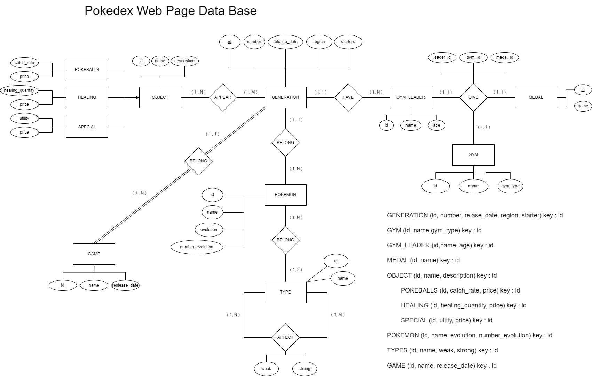

# M02-Base De Datos  

En este modulo aprendi la creacion y gestion de BBDD en mariadb

## UF1

En la UF1 aprendi ha hacer el Diagramas de modelo ER
En la siguiente imagen Podemos ver el diagrama del la Pokedex

## UF2

En UF2 aprendia crear bases de datos, tablas, alterarlas , insertar datos y consultas a las tablas

[UF2 Pokedex Tables inserts y consultas]()

## UF3

En UF3 aprendi crearson y gestion de usuarios y permisos , creacion de procedimientos

[UF3 Pekedex permisos , usuarios y procedimientos]()
